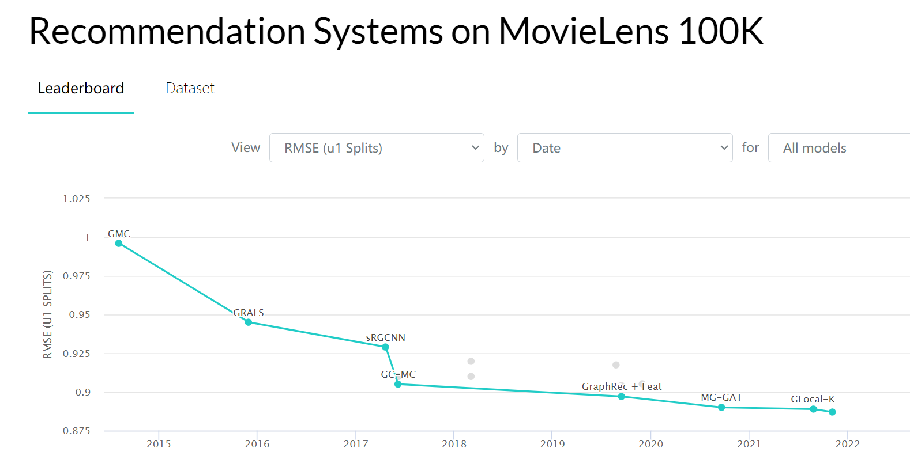
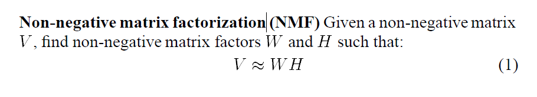

# CF_ML100k

## TODO
- [x] 训练/测试样本划分， 协同过滤是否支持用户短期滑动窗口记录以及能否根据用户的变化的历史记录进行动态的推荐
- [ ] 加入对于embedding的可视化
- [ ] 加入使用SVD++的计算方式

## Movielens 指标榜单
- https://paperswithcode.com/dataset/movielens
- https://paperswithcode.com/sota/collaborative-filtering-on-movielens-100k
- https://paperswithcode.com/sota/collaborative-filtering-on-movielens-1m?metric=NDCG

## Baseline 仓库

## Non-negative matrix factorization 算法流程

- 目标：将user-item矩阵进行矩阵分解成user embedding矩阵和item embedding矩阵，从而提取user/item embedding

- user-item矩阵可以表示为user-item 频次矩阵，也可以表示为user-item 评分矩阵
- non-negative 约束embedding的点积为正数

## 可视化

- 选取用户的高评分item，与自身embedding 进行比较